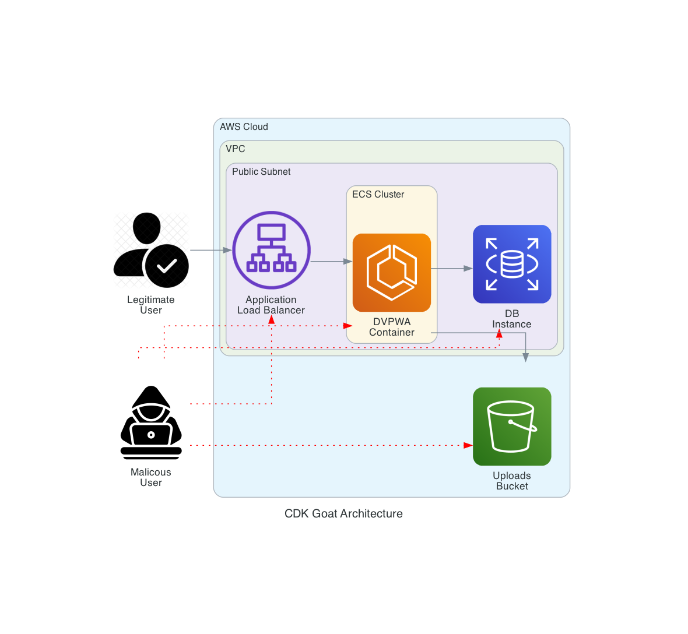

# CDK Goat - Vulnerable AWS CDK Infrastructure


## Overview

This repository serves as a demonstration of a "vulnerable-by-design" AWS Cloud Development Kit (CDK) infrastructure. The primary purpose is to showcase the deployment of a containerized application within an AWS environment, emphasizing security vulnerabilities for educational purposes.

**Disclaimer: This repository is intended for educational and awareness purposes only. Do not deploy this in a production environment. Be aware of the security implications associated with running vulnerable applications.**

## Contents

1. [Setup](#setup)
   - [Prerequisites](#prerequisites)
   - [Installation](#installation)
2. [Usage](#usage)
   - [Deploying the Vulnerable Infrastructure](#deploying-the-vulnerable-infrastructure)
   - [Accessing the Vulnerable Application](#accessing-the-vulnerable-application)
   - [Investigating CloudFormation Outputs](#investigating-cloudformation-outputs)
3. [License](#license)

## Architecture

See the following architecture of the app, generated by the [Diagrams](https://diagrams.mingrammer.com/) library:



## Setup

### Prerequisites

Before deploying the vulnerable infrastructure, ensure you have the following prerequisites:

- [AWS CLI](https://aws.amazon.com/cli/)
- [Node.js](https://nodejs.org/)
- [Poetry](https://python-poetry.org/)
- [Docker](https://www.docker.com/)
- [AWS CDK](https://aws.amazon.com/cdk/)

### Installation

1. Clone this repository:

   ```bash
   git clone https://github.com/avishayil/cdk-goat.git
   cd cdk-goat
   ```

2. Install dependencies:

   ```
   § npm install -g aws-cdk
   § poetry install --no-root
   ```

## Usage

### Deploying the Vulnerable Infrastructure

Deploy the vulnerable AWS CDK infrastructure using the following steps:

   ```
    # Activate virtual environment
    § source .venv/bin/activate

    # Deploy AWS CDK infrastructure
    § cdk deploy
   ```

### Accessing the Vulnerable Infrastructure

#### Connecting to the ECS Container:

Use the helper script:
```bash
./scripts/aws_connect.sh

    Tasks in the CDKGoatStack-ContainersConstructCluster2F30CE40-zVkcz3MqwUTK cluster:
    0. arn:aws:ecs:eu-west-1:123456789012:task/CDKGoatStack-ContainersConstructCluster2F30CE40-zVkcz3MqwUTK/6fb6ab52095c4dd08a3031a899f04d23
    Enter the task number you want to connect to: 0
    Containers in the selected task:
    0. backend_app
    Enter the container number you want to connect to: 0

    The Session Manager plugin was installed successfully. Use the AWS CLI to start a session.


    Starting session with SessionId: ecs-execute-command-01948fc28b33b2fd5
    root@ip-192-168-0-40:/app# your-command
```

####

Investigate the CloudFormation outputs:

### CloudFormation Outputs

| Output Name          | Description                                                | Value                       |
|----------------------|------------------------------------------------------------|-----------------------------|
| ClusterARN           | The Amazon Resource Name (ARN) of the cluster.             | `<ClusterARN value>`        |
| ApplicationLBDNS     | The DNS name of the load balancer associated with the application. | `<ApplicationLBDNS value>` |
| DBInstanceEndpoint   | The endpoint of the database instance.                     | `<DBInstanceEndpoint value>`|
| DBName               | The name of the database.                                   | `<DBName value>`            |
| UploadsBucketName    | The name of the bucket for file uploads.                    | `<UploadsBucketName value>` |

### Accessing the Vulnerable Application

See [DVPWA](cdk/containers/dvpwa/README.rst)

### Exploring Security Vulnerabilities

All infrastructure, third parties and code vulnerabilities are powered by [Snyk](https://snyk.io) scanning utilities and uploaded to [GitHub Code Scanning](https://docs.github.com/en/code-security/code-scanning/introduction-to-code-scanning/about-code-scanning) using the SARIF format. You can explore all of the vulnerabilities here: https://github.com/avishayil/cdk-goat/security/code-scanning

## Credits

- [DVPWA](https://github.com/anxolerd/dvpwa) by [@anxolerd](https://github.com/anxolerd) (We stand with Ukraine! 🇺🇦🇺🇦🇺🇦)

## License

See [LICENSE.md](LICENSE.md)
